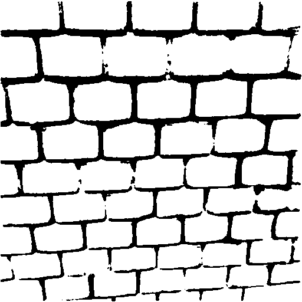
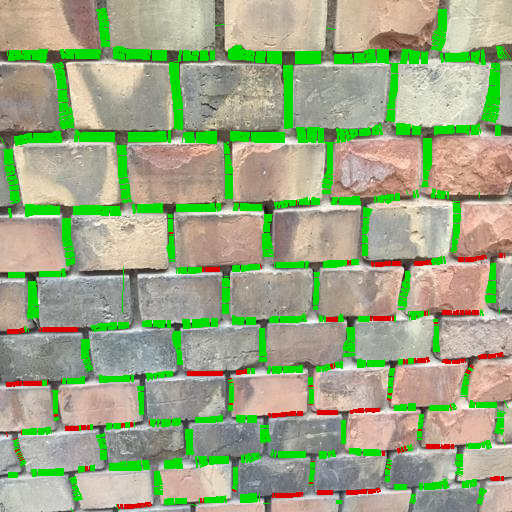

# masonry_detection
Masonry detection via neural networks and classic cv algorithms

<div align="center">
    
    
</div>

## Installation

To download repo, you should have [git-lfs](https://git-lfs.github.com) library. Also for containing new libs you can use [venv](https://docs.python.org/3/tutorial/venv.html) to install libraries.

```bash
git clone https://github.com/Ilyabasharov/masonry_detection.git
git lfs fetch && git lfs pull
```

### Install requirements

```bash
pip3 install -r requirements.txt
```

### Download a dataset

```bash
cd scripts
sh download_data.sh
```

## How to run

### Semantic segmentation

To train your model on [MasonryWallAnalysis](http://mplab.sztaki.hu/geocomp/masonryWallAnalysis), please use jupyter notebook.

To inference trained model, use script with args:

```bash
cd src
python3 segmentation.py \
    --input_images_path [video or image folder] \
    --path_to_weights [model weights path] \
    --annotate [bool tag, true if specified] \
    --where_to_save [if annotate, set path to save folder]
```

### Masonry shape evaluation

```bash
cd src
python3 masonry.py \
    --input_images_path [image folder] \
    --input_masks_path [masks folder] \
    --annotate [bool tag, true if specified] \
    --where_to_save [if annotate, set path to save folder]
```

### Run whole algorithm

```bash
cd src
python3 main.py \
    --brick_width [Brick width in millimeters] \
    --brick_height [Brick height in millimeters] \
    --threshold_shape [Threshold masonry shape in millimeters] \
    --input_images_path [image folder] \
    --annotate [bool tag, true if specified] \
    --where_to_save [if annotate, set path to save folder]
```